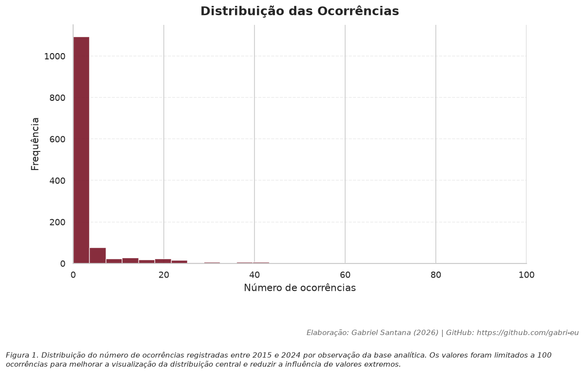
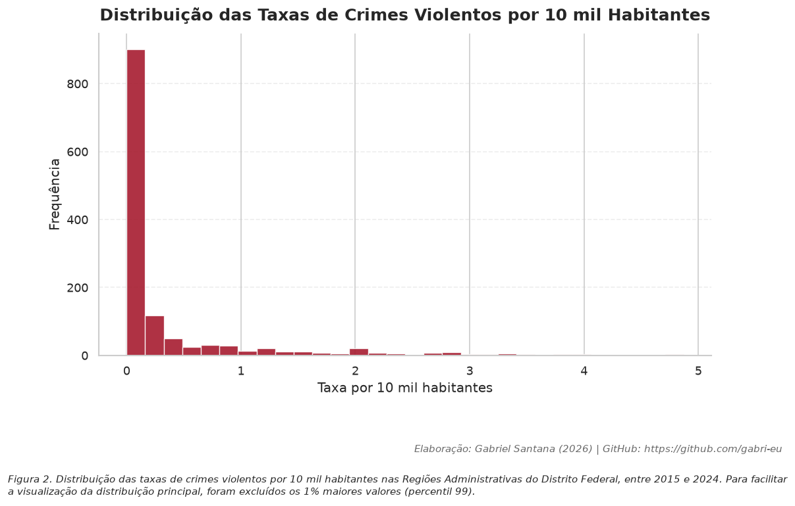
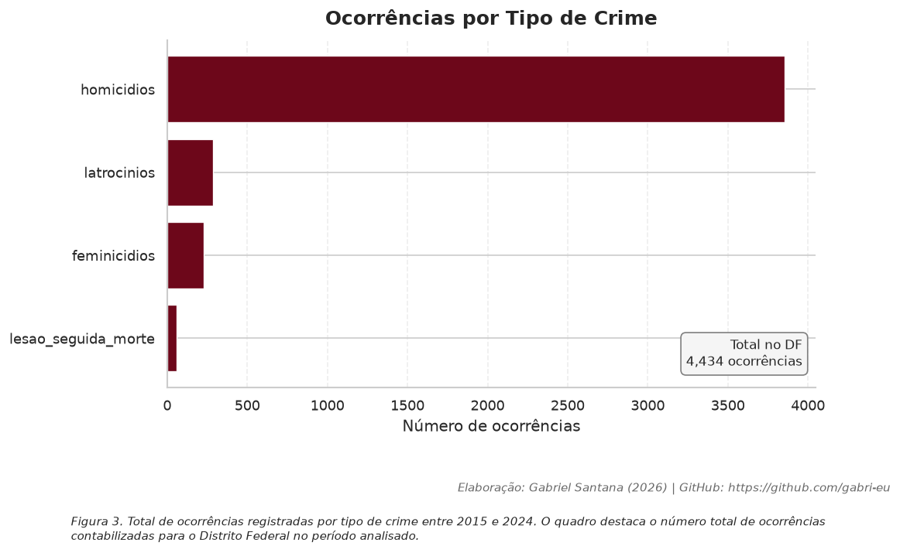
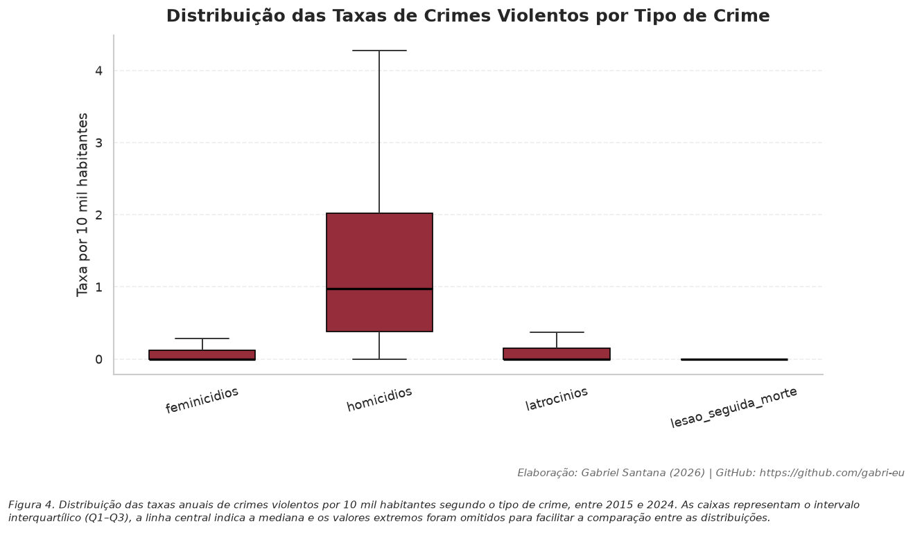
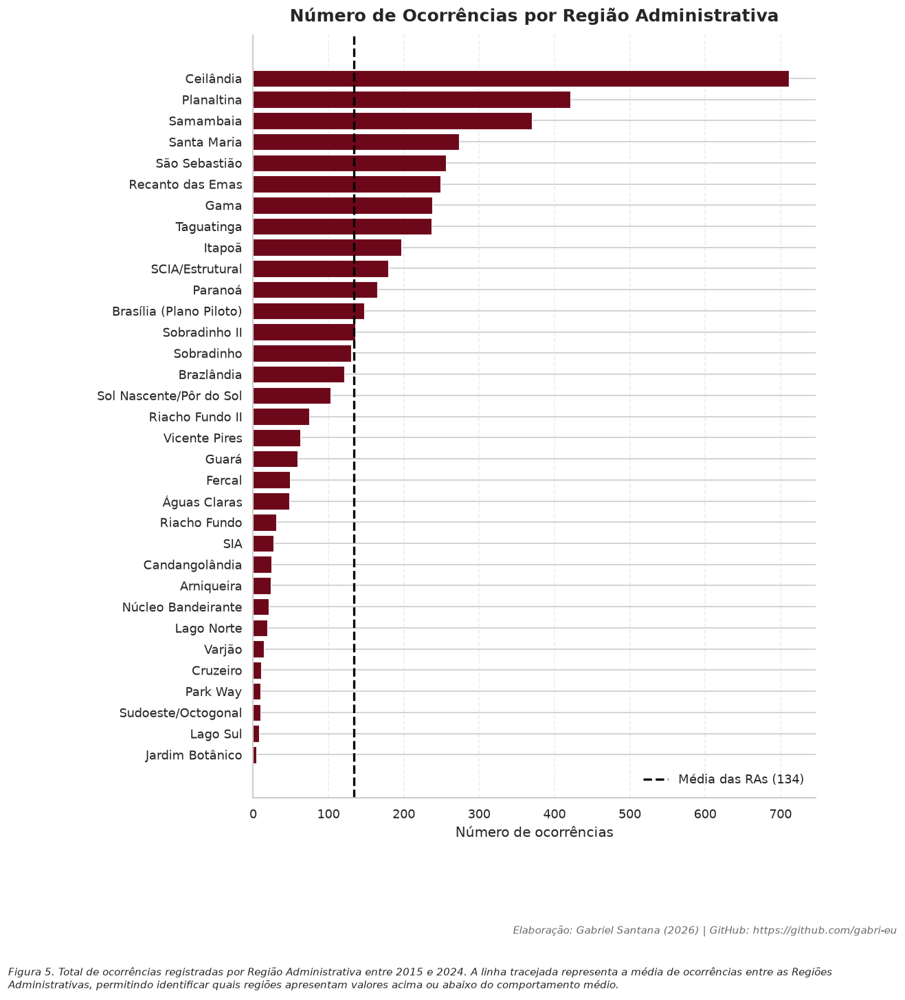
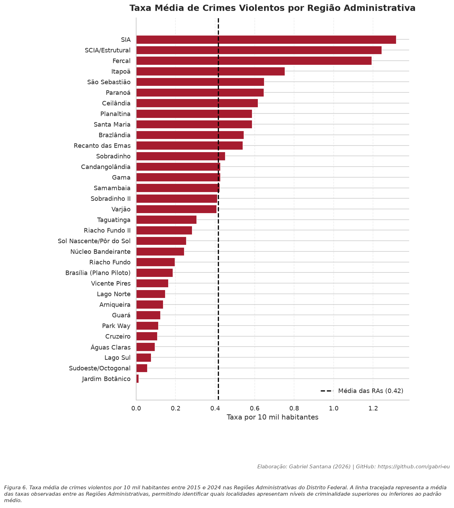
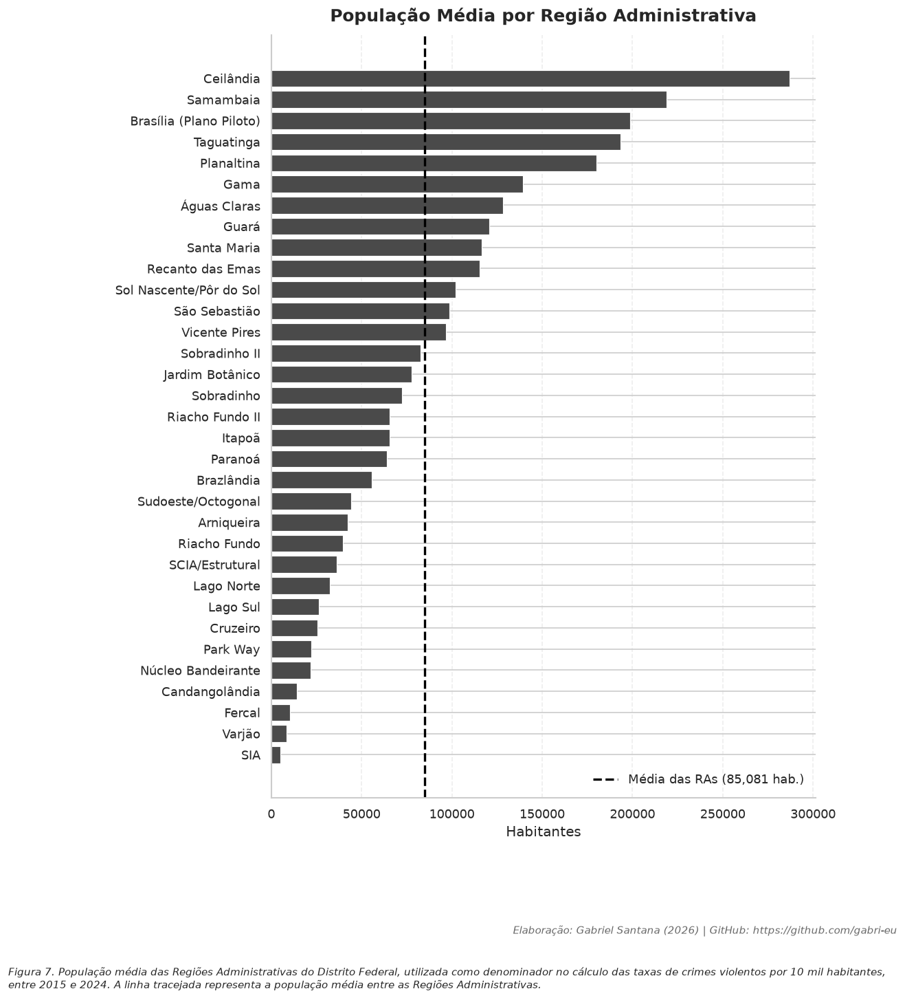
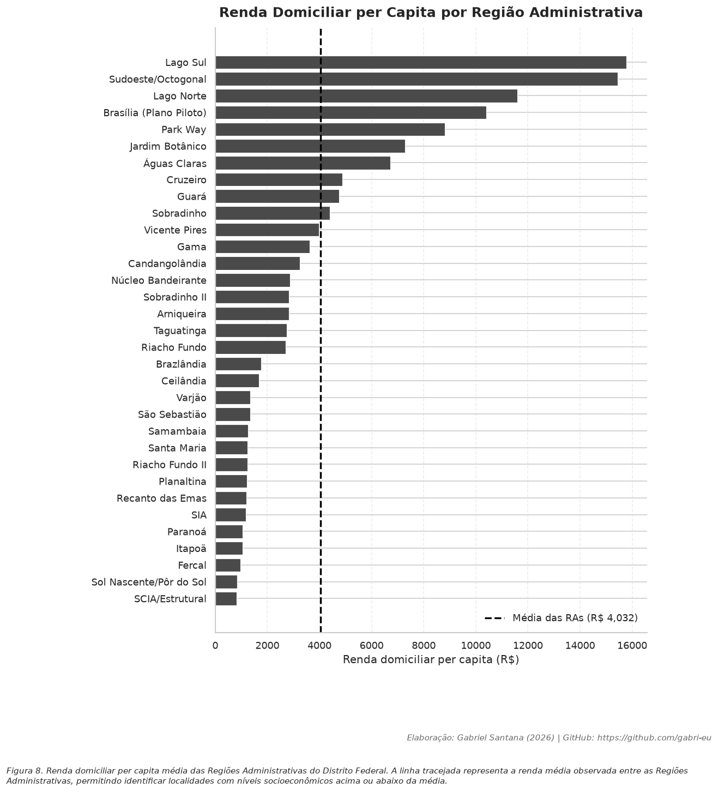
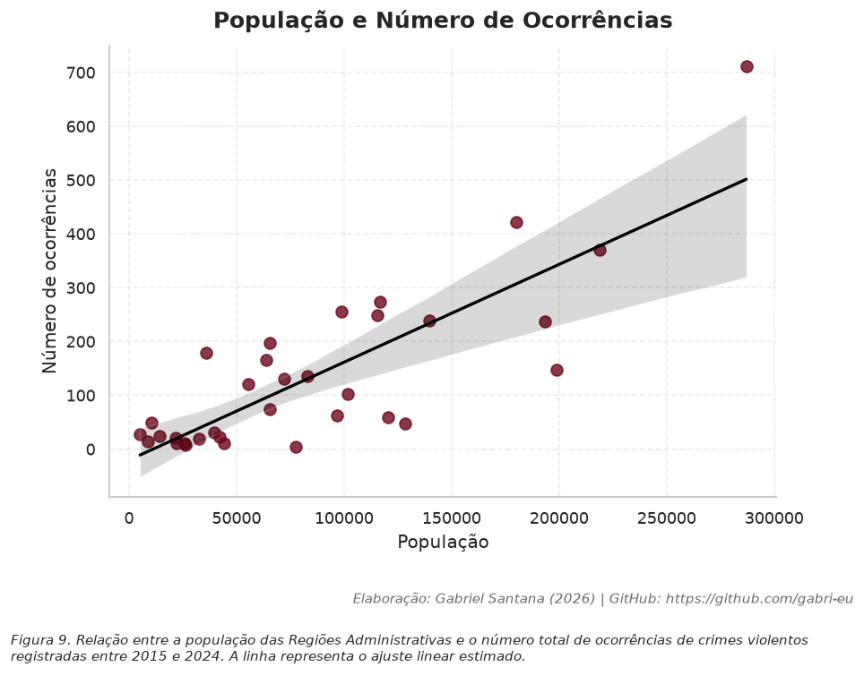
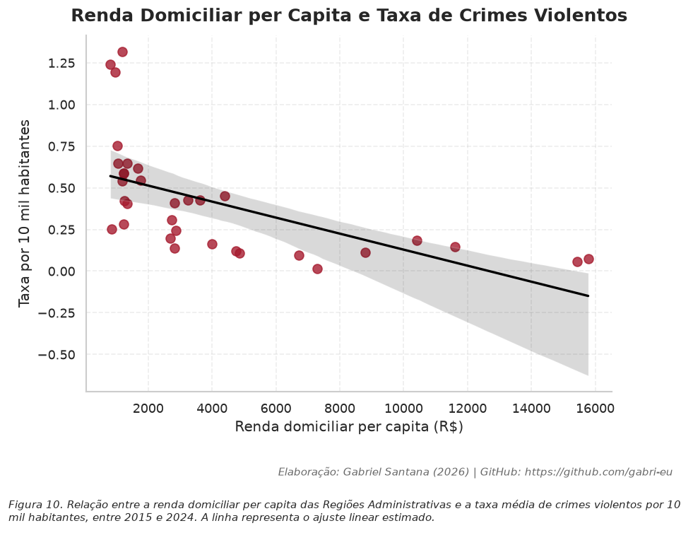

# Crimes Violentos no Distrito Federal (2015–2024)

Análise exploratória e construção de uma base analítica consolidada sobre os crimes violentos registrados no Distrito Federal entre 2015 e 2024.

O projeto reúne diferentes bases públicas da Secretaria de Segurança Pública do Distrito Federal (SSP/DF), padroniza suas estruturas, consolida as informações em uma única base e produz análises estatísticas e visualizações para apoiar pesquisas sobre a distribuição espacial e temporal da violência no DF.

---

## Objetivos

- Consolidar diferentes bases de crimes violentos em uma estrutura única;
- Padronizar nomenclaturas de Regiões Administrativas e variáveis;
- Criar uma base analítica pronta para pesquisas e visualizações;
- Produzir estatísticas descritivas sobre a violência no Distrito Federal;
- Disponibilizar um pipeline reproduzível em Python.

---

# Crimes analisados

O projeto contempla os seguintes grupos criminais:

- Homicídios
- Latrocínios
- Feminicídios
- Lesões Corporais Seguidas de Morte

Período analisado:

**2015–2024**

---

# Estrutura do projeto

```
Crimes-Violentos-DF/
│
├── dados_brutos/
│
├── dados_processados/
│   ├── base_crimes_violentos.csv
│   ├── base_ra.csv
│   └── ...
│
├── notebooks/
│   ├── 01_consolidacao.ipynb
│   ├── 02_estruturacao.ipynb
│   ├── 03_analise_descritiva.ipynb
│   └── ...
│
├── imagens/
│
├── README.md
└── requirements.txt
```

---

# Pipeline

O projeto foi dividido em notebooks independentes.

## Notebook 01 — Consolidação

Responsável por:

- leitura das bases originais;
- padronização das colunas;
- tratamento de datas;
- unificação dos quatro bancos;
- geração da base consolidada.

---

## Notebook 02 — Estruturação

Responsável por:

- limpeza das Regiões Administrativas;
- criação das dimensões auxiliares;
- padronização espacial;
- construção da base analítica.

Também identifica automaticamente:

- regiões inexistentes;
- divergências de nomenclatura;
- registros de Unidades Prisionais.

---

## Notebook 03 — Estatística Descritiva

Produz:

- estatísticas gerais;
- séries temporais;
- distribuição espacial;
- ranking das Regiões Administrativas;
- tabelas resumo;
- gráficos utilizados no artigo.

---

# Tecnologias

- Python
- Pandas
- NumPy
- Matplotlib
- Seaborn
- Jupyter Notebook

---

# Base Analítica

Após o processamento, a base contém, entre outras variáveis:

| Variável | Descrição |
|----------|-----------|
| ano | Ano do crime |
| mes | Mês do crime |
| natureza | Tipo de crime |
| regiao_administrativa | Região Administrativa |
| latitude | Latitude (quando disponível) |
| longitude | Longitude (quando disponível) |
| sexo | Sexo da vítima |
| idade | Faixa etária |
| arma | Instrumento utilizado |
| local | Local do fato |

---

# Exemplos de resultados

## Distribuição das ocorrências



---

## Distribuição das taxas de crimes violentos



---

## Ocorrências por tipo de crime



---

## Distribuição das taxas por tipo de crime



---

## Ocorrências por Região Administrativa



---

## Taxa média por Região Administrativa



---

## População por Região Administrativa



---

## Renda domiciliar per capita por Região Administrativa



---

## População e número de ocorrências



---

## Renda per capita e taxa de crimes violentos



---

# Principais resultados

- Consolidação de quatro bases oficiais em um único banco analítico.
- Padronização completa das Regiões Administrativas.
- Tratamento específico para registros provenientes das Unidades Prisionais.
- Pipeline totalmente reproduzível.
- Geração automática de tabelas e gráficos para utilização em artigos científicos.

---

# Fonte dos dados

Secretaria de Segurança Pública do Distrito Federal (SSP/DF)

Bases públicas disponibilizadas pelo Portal de Dados Abertos.

---

# Como executar

Clone o repositório:

```bash
git clone https://github.com/gabri-eu/Crimes-Violentos-DF.git
```

Instale as dependências:

```bash
pip install -r requirements.txt
```

Abra os notebooks:

```bash
jupyter lab
```

Execute-os na seguinte ordem:

1. Notebook 01 — Consolidação
2. Notebook 02 — Estruturação
3. Notebook 03 — Estatística Descritiva

---

# Licença

Este projeto é disponibilizado exclusivamente para fins acadêmicos e científicos.

Os dados utilizados permanecem sob responsabilidade da Secretaria de Segurança Pública do Distrito Federal.
